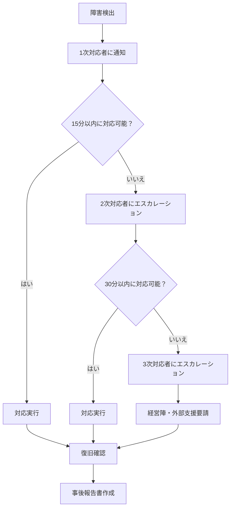

# ディザスタリカバリ戦略

このガイドでは、Roster Bridge JPP アプリケーションの Azure デプロイにおけるディザスタリカバリ（DR）戦略を説明します。

## 目次

1. [DR の概要と目標](#drの概要と目標)
2. [バックアップ戦略](#バックアップ戦略)
3. [地理的冗長性](#地理的冗長性)
4. [自動フェイルオーバー](#自動フェイルオーバー)
5. [データレプリケーション](#データレプリケーション)
6. [復旧手順](#復旧手順)
7. [テストとメンテナンス](#テストとメンテナンス)

## DR の概要と目標

### Recovery Time Objective (RTO) と Recovery Point Objective (RPO)

| コンポーネント | RTO 目標 | RPO 目標 | 重要度 |
|---------------|----------|----------|--------|
| ウェブアプリケーション | 30分 | 15分 | 高 |
| データベース | 1時間 | 5分 | 極高 |
| ファイルストレージ | 2時間 | 30分 | 中 |
| 監視システム | 15分 | 0分 | 高 |

### 災害シナリオの分類

1. **レベル1**: 単一サーバーまたはサービスの障害
2. **レベル2**: データセンター全体の障害
3. **レベル3**: リージョン全体の障害
4. **レベル4**: セキュリティインシデント（データ破損/漏洩）

## バックアップ戦略

### 1. データベースバックアップ

```bash
# PostgreSQL の自動バックアップ設定
az postgres flexible-server update \
  --resource-group $RESOURCE_GROUP \
  --name $DB_SERVER_NAME \
  --backup-retention 35 \
  --geo-redundant-backup Enabled

# 手動バックアップの作成
az postgres flexible-server backup create \
  --resource-group $RESOURCE_GROUP \
  --name $DB_SERVER_NAME \
  --backup-name "manual-backup-$(date +%Y%m%d-%H%M%S)"

# Point-in-time リストアの実行
restore_db() {
    local restore_time=$1
    local new_server_name="${DB_SERVER_NAME}-restored-$(date +%Y%m%d-%H%M%S)"
    
    az postgres flexible-server restore \
      --resource-group $RESOURCE_GROUP \
      --name $new_server_name \
      --source-server $DB_SERVER_NAME \
      --restore-time $restore_time
    
    echo "データベースが $new_server_name に復元されました"
}
```

### 2. アプリケーションデータのバックアップ

```bash
# Azure Storage Account の作成（バックアップ用）
az storage account create \
  --name "${APP_NAME}backup$(date +%Y%m%d)" \
  --resource-group $RESOURCE_GROUP \
  --location $LOCATION \
  --sku Standard_GRS \
  --kind StorageV2

# アプリケーション設定のバックアップ
backup_app_config() {
    local backup_date=$(date +%Y%m%d-%H%M%S)
    local backup_file="app-config-backup-${backup_date}.json"
    
    # Container App 設定の取得
    az containerapp show \
      --name $APP_NAME \
      --resource-group $RESOURCE_GROUP > $backup_file
    
    # Key Vault シークレットの一覧
    az keyvault secret list \
      --vault-name "${APP_NAME}-kv" \
      --query "[].{name:name, version:id}" >> $backup_file
    
    # Storage への保存
    az storage blob upload \
      --account-name "${APP_NAME}backup$(date +%Y%m%d)" \
      --container-name config-backups \
      --name $backup_file \
      --file $backup_file
    
    echo "アプリケーション設定をバックアップしました: $backup_file"
}
```

### 3. Infrastructure as Code のバックアップ

```bash
# Bicep テンプレートとパラメータファイルのバックアップ
backup_infrastructure() {
    local backup_date=$(date +%Y%m%d-%H%M%S)
    local backup_dir="infrastructure-backup-${backup_date}"
    
    mkdir -p $backup_dir
    
    # 現在のリソース設定のエクスポート
    az group export \
      --resource-group $RESOURCE_GROUP \
      --output-path "${backup_dir}/exported-template.json"
    
    # Bicep ファイルのコピー
    cp -r infrastructure/ "${backup_dir}/"
    cp -r scripts/ "${backup_dir}/"
    cp -r k8s/ "${backup_dir}/"
    
    # Git リポジトリの状態保存
    git bundle create "${backup_dir}/repo-backup.bundle" --all
    
    # 圧縮とクラウドストレージへの保存
    tar -czf "${backup_dir}.tar.gz" $backup_dir
    
    az storage blob upload \
      --account-name "${APP_NAME}backup$(date +%Y%m%d)" \
      --container-name infrastructure-backups \
      --name "${backup_dir}.tar.gz" \
      --file "${backup_dir}.tar.gz"
    
    rm -rf $backup_dir "${backup_dir}.tar.gz"
    
    echo "インフラストラクチャ設定をバックアップしました"
}
```

## 地理的冗長性

### 1. セカンダリリージョンの設定

```bash
# セカンダリリージョンの設定
SECONDARY_REGION="japanwest"
SECONDARY_RESOURCE_GROUP="rg-${APP_NAME}-dr"

# セカンダリリソースグループの作成
az group create \
  --name $SECONDARY_RESOURCE_GROUP \
  --location $SECONDARY_REGION

# セカンダリ ACR の作成
az acr create \
  --resource-group $SECONDARY_RESOURCE_GROUP \
  --name "${APP_NAME}acrdr" \
  --sku Premium \
  --admin-enabled true

# イメージの地理的レプリケーション
az acr replication create \
  --registry $ACR_NAME \
  --location $SECONDARY_REGION
```

### 2. Azure Traffic Manager の設定

```bash
# Traffic Manager プロファイルの作成
az network traffic-manager profile create \
  --resource-group $RESOURCE_GROUP \
  --name "${APP_NAME}-tm" \
  --routing-method Priority \
  --unique-dns-name "${APP_NAME}-global"

# プライマリエンドポイントの追加
az network traffic-manager endpoint create \
  --resource-group $RESOURCE_GROUP \
  --profile-name "${APP_NAME}-tm" \
  --name "primary-endpoint" \
  --type azureEndpoints \
  --target-resource-id $CONTAINER_APP_ID \
  --priority 1 \
  --endpoint-status enabled

# セカンダリエンドポイントの追加（後で設定）
# az network traffic-manager endpoint create \
#   --resource-group $RESOURCE_GROUP \
#   --profile-name "${APP_NAME}-tm" \
#   --name "secondary-endpoint" \
#   --type azureEndpoints \
#   --target-resource-id $SECONDARY_CONTAINER_APP_ID \
#   --priority 2 \
#   --endpoint-status enabled
```

### 3. セカンダリサイトのデプロイ

```bash
# scripts/deploy-secondary-site.sh
#!/bin/bash

deploy_secondary_site() {
    echo "セカンダリサイトをデプロイしています..."
    
    # セカンダリ Key Vault の作成
    az keyvault create \
      --name "${APP_NAME}-kv-dr" \
      --resource-group $SECONDARY_RESOURCE_GROUP \
      --location $SECONDARY_REGION
    
    # プライマリから設定をコピー
    az keyvault secret list \
      --vault-name "${APP_NAME}-kv" \
      --query "[].name" \
      --output tsv | while read secret_name; do
        secret_value=$(az keyvault secret show \
          --vault-name "${APP_NAME}-kv" \
          --name $secret_name \
          --query "value" --output tsv)
        
        az keyvault secret set \
          --vault-name "${APP_NAME}-kv-dr" \
          --name $secret_name \
          --value "$secret_value"
    done
    
    # セカンダリ Container Apps 環境の作成
    az containerapp env create \
      --name "${APP_NAME}-env-dr" \
      --resource-group $SECONDARY_RESOURCE_GROUP \
      --location $SECONDARY_REGION
    
    # セカンダリアプリケーションのデプロイ
    az containerapp create \
      --name "${APP_NAME}-dr" \
      --resource-group $SECONDARY_RESOURCE_GROUP \
      --environment "${APP_NAME}-env-dr" \
      --image "${ACR_NAME}.azurecr.io/roster-bridge-jpp:latest" \
      --target-port 8000 \
      --ingress external \
      --min-replicas 0 \
      --max-replicas 3
    
    echo "セカンダリサイトのデプロイが完了しました"
}
```

## 自動フェイルオーバー

### 1. ヘルスチェックとアラート設定

```bash
# プライマリサイトのヘルスチェック
az monitor metrics alert create \
  --name "${APP_NAME}-primary-health" \
  --resource-group $RESOURCE_GROUP \
  --scopes $CONTAINER_APP_ID \
  --condition "avg Requests where ResultCode startswith '5' > 50" \
  --window-size 5m \
  --evaluation-frequency 1m \
  --severity 1 \
  --description "プライマリサイトで深刻なエラーが発生" \
  --action $ACTION_GROUP_ID

# 自動フェイルオーバーのためのロジックアプリ
az logic workflow create \
  --resource-group $RESOURCE_GROUP \
  --name "${APP_NAME}-failover-logic" \
  --definition '{
    "definition": {
      "$schema": "https://schema.management.azure.com/providers/Microsoft.Logic/schemas/2016-06-01/workflowdefinition.json#",
      "triggers": {
        "manual": {
          "type": "Request",
          "kind": "Http"
        }
      },
      "actions": {
        "Enable_Secondary_Site": {
          "type": "Http",
          "inputs": {
            "method": "POST",
            "uri": "https://management.azure.com/subscriptions/'$SUBSCRIPTION_ID'/resourceGroups/'$SECONDARY_RESOURCE_GROUP'/providers/Microsoft.App/containerApps/'${APP_NAME}-dr'/start",
            "authentication": {
              "type": "ManagedServiceIdentity"
            }
          }
        },
        "Update_Traffic_Manager": {
          "type": "Http",
          "inputs": {
            "method": "PATCH",
            "uri": "https://management.azure.com/subscriptions/'$SUBSCRIPTION_ID'/resourceGroups/'$RESOURCE_GROUP'/providers/Microsoft.Network/trafficManagerProfiles/'${APP_NAME}-tm'/azureEndpoints/primary-endpoint",
            "body": {
              "properties": {
                "endpointStatus": "Disabled"
              }
            }
          }
        }
      }
    }
  }'
```

### 2. 自動スケーリングとフェイルオーバー

```python
# scripts/auto_failover.py
import os
import time
import requests
from azure.identity import DefaultAzureCredential
from azure.mgmt.containerinstance import ContainerInstanceManagementClient

class AutoFailover:
    def __init__(self):
        self.credential = DefaultAzureCredential()
        self.subscription_id = os.getenv('AZURE_SUBSCRIPTION_ID')
        self.primary_url = os.getenv('PRIMARY_SITE_URL')
        self.secondary_url = os.getenv('SECONDARY_SITE_URL')
        
    def check_primary_health(self):
        """プライマリサイトのヘルスチェック"""
        try:
            response = requests.get(f"{self.primary_url}/health", timeout=10)
            return response.status_code == 200
        except:
            return False
    
    def activate_secondary_site(self):
        """セカンダリサイトの有効化"""
        container_client = ContainerInstanceManagementClient(
            self.credential, self.subscription_id
        )
        
        # セカンダリサイトのスケールアップ
        container_client.container_apps.begin_start(
            resource_group_name=os.getenv('SECONDARY_RESOURCE_GROUP'),
            container_app_name=f"{os.getenv('APP_NAME')}-dr"
        )
        
        print("セカンダリサイトを有効化しました")
    
    def monitor_and_failover(self):
        """継続的監視とフェイルオーバー"""
        failure_count = 0
        max_failures = 3
        
        while True:
            if not self.check_primary_health():
                failure_count += 1
                print(f"プライマリサイトの障害を検出 ({failure_count}/{max_failures})")
                
                if failure_count >= max_failures:
                    print("フェイルオーバーを実行します")
                    self.activate_secondary_site()
                    break
            else:
                failure_count = 0
            
            time.sleep(30)

if __name__ == "__main__":
    failover = AutoFailover()
    failover.monitor_and_failover()
```

## データレプリケーション

### 1. PostgreSQL Read Replica の設定

```bash
# 読み取りレプリカの作成
az postgres flexible-server replica create \
  --replica-name "${DB_SERVER_NAME}-replica" \
  --resource-group $SECONDARY_RESOURCE_GROUP \
  --source-server "/subscriptions/$SUBSCRIPTION_ID/resourceGroups/$RESOURCE_GROUP/providers/Microsoft.DBforPostgreSQL/flexibleServers/$DB_SERVER_NAME"

# レプリカの昇格（フェイルオーバー時）
promote_replica() {
    echo "レプリカをプライマリに昇格しています..."
    
    az postgres flexible-server replica stop \
      --replica-name "${DB_SERVER_NAME}-replica" \
      --resource-group $SECONDARY_RESOURCE_GROUP
    
    echo "レプリカが独立したサーバーになりました"
}
```

### 2. アプリケーションデータの同期

```python
# scripts/data_sync.py
import os
import time
import asyncio
import asyncpg
from datetime import datetime, timedelta

class DataSynchronizer:
    def __init__(self):
        self.primary_db_url = os.getenv('PRIMARY_DATABASE_URL')
        self.secondary_db_url = os.getenv('SECONDARY_DATABASE_URL')
        
    async def sync_critical_data(self):
        """重要データの定期同期"""
        primary_conn = await asyncpg.connect(self.primary_db_url)
        secondary_conn = await asyncpg.connect(self.secondary_db_url)
        
        try:
            # 最新の変更データを取得
            recent_changes = await primary_conn.fetch("""
                SELECT * FROM audit_log 
                WHERE created_at > NOW() - INTERVAL '5 minutes'
                ORDER BY created_at DESC
            """)
            
            # セカンダリサイトに反映
            for change in recent_changes:
                await self.apply_change_to_secondary(secondary_conn, change)
                
        finally:
            await primary_conn.close()
            await secondary_conn.close()
    
    async def apply_change_to_secondary(self, conn, change):
        """セカンダリサイトへの変更適用"""
        table_name = change['table_name']
        operation = change['operation']
        data = change['data']
        
        if operation == 'INSERT':
            await conn.execute(f"INSERT INTO {table_name} VALUES {data}")
        elif operation == 'UPDATE':
            await conn.execute(f"UPDATE {table_name} SET {data}")
        elif operation == 'DELETE':
            await conn.execute(f"DELETE FROM {table_name} WHERE {data}")

# 定期実行
async def main():
    sync = DataSynchronizer()
    while True:
        try:
            await sync.sync_critical_data()
            print(f"データ同期完了: {datetime.now()}")
        except Exception as e:
            print(f"同期エラー: {e}")
        
        await asyncio.sleep(300)  # 5分間隔

if __name__ == "__main__":
    asyncio.run(main())
```

## 復旧手順

### 1. 緊急時復旧手順書

```bash
# scripts/emergency-recovery.sh
#!/bin/bash

RECOVERY_SCENARIO=$1
RECOVERY_TIME=$(date -u +"%Y-%m-%dT%H:%M:%SZ")

emergency_recovery() {
    echo "=== 緊急復旧手順を開始 ==="
    echo "復旧シナリオ: $RECOVERY_SCENARIO"
    echo "復旧開始時刻: $RECOVERY_TIME"
    
    case $RECOVERY_SCENARIO in
        "level1-service-failure")
            level1_recovery
            ;;
        "level2-datacenter-failure")
            level2_recovery
            ;;
        "level3-region-failure")
            level3_recovery
            ;;
        "level4-security-incident")
            level4_recovery
            ;;
        *)
            echo "不明な復旧シナリオです"
            exit 1
            ;;
    esac
}

level1_recovery() {
    echo "レベル1復旧: サービス障害対応"
    
    # 1. 障害サービスの再起動
    az containerapp restart \
      --name $APP_NAME \
      --resource-group $RESOURCE_GROUP
    
    # 2. ヘルスチェック
    sleep 60
    check_application_health
    
    # 3. 必要に応じてスケールアップ
    az containerapp update \
      --name $APP_NAME \
      --resource-group $RESOURCE_GROUP \
      --min-replicas 2 \
      --max-replicas 10
}

level2_recovery() {
    echo "レベル2復旧: データセンター障害対応"
    
    # 1. セカンダリリージョンへのフェイルオーバー
    activate_secondary_region
    
    # 2. DNS の切り替え
    update_traffic_manager_priority
    
    # 3. データベースレプリカの昇格
    promote_database_replica
}

level3_recovery() {
    echo "レベル3復旧: リージョン障害対応"
    
    # 1. 別リージョンでの完全再構築
    deploy_to_alternative_region
    
    # 2. バックアップからのデータ復元
    restore_from_backup
    
    # 3. サービスの段階的復旧
    gradual_service_restoration
}

level4_recovery() {
    echo "レベル4復旧: セキュリティインシデント対応"
    
    # 1. 全サービスの即座停止
    emergency_shutdown
    
    # 2. フォレンジック調査用のデータ保全
    preserve_evidence
    
    # 3. クリーンな環境での再構築
    clean_rebuild
}

check_application_health() {
    local max_attempts=10
    local attempt=1
    
    while [ $attempt -le $max_attempts ]; do
        if curl -f -s "https://${APP_NAME}.azurecontainerapps.io/health" > /dev/null; then
            echo "✅ アプリケーションは正常に動作しています"
            return 0
        fi
        
        echo "⏳ ヘルスチェック試行 $attempt/$max_attempts"
        sleep 30
        ((attempt++))
    done
    
    echo "❌ アプリケーションのヘルスチェックに失敗しました"
    return 1
}
```

### 2. 段階的復旧プロセス

```yaml
# recovery-playbook.yml
- name: Disaster Recovery Playbook
  hosts: localhost
  vars:
    recovery_phases:
      - phase: immediate
        duration: "0-30 minutes"
        actions:
          - assess_damage
          - activate_incident_response_team
          - isolate_affected_systems
      
      - phase: short_term
        duration: "30 minutes - 4 hours"
        actions:
          - activate_secondary_systems
          - restore_critical_data
          - communicate_with_stakeholders
      
      - phase: medium_term
        duration: "4-24 hours"
        actions:
          - full_service_restoration
          - performance_optimization
          - user_notification
      
      - phase: long_term
        duration: "1-7 days"
        actions:
          - post_incident_review
          - improve_procedures
          - update_documentation

  tasks:
    - name: Execute recovery phases
      include_tasks: "recovery_phase_{{ item.phase }}.yml"
      loop: "{{ recovery_phases }}"
```

## テストとメンテナンス

### 1. 定期的な DR テスト

```bash
# scripts/dr-test.sh
#!/bin/bash

DR_TEST_TYPE=$1
TEST_DATE=$(date +%Y%m%d)

conduct_dr_test() {
    echo "=== DR テストを実行: $DR_TEST_TYPE ==="
    
    case $DR_TEST_TYPE in
        "tabletop")
            tabletop_exercise
            ;;
        "partial")
            partial_failover_test
            ;;
        "full")
            full_dr_test
            ;;
    esac
    
    generate_test_report
}

tabletop_exercise() {
    echo "テーブルトップエクササイズを実行"
    
    # DR手順書の確認
    echo "📋 DR手順書のレビュー"
    echo "👥 担当者の役割確認"
    echo "🔗 連絡網の確認"
    echo "⏱️ 復旧時間の見積もり"
}

partial_failover_test() {
    echo "部分的フェイルオーバーテストを実行"
    
    # テスト環境でのフェイルオーバー
    echo "🧪 テスト環境でのフェイルオーバー実行"
    
    # セカンダリサイトの起動テスト
    az containerapp update \
      --name "${APP_NAME}-test" \
      --resource-group "${RESOURCE_GROUP}-test" \
      --min-replicas 1
    
    # データ同期テスト
    test_data_synchronization
    
    # ロールバックテスト
    az containerapp update \
      --name "${APP_NAME}-test" \
      --resource-group "${RESOURCE_GROUP}-test" \
      --min-replicas 0
}

full_dr_test() {
    echo "⚠️  完全 DR テストを実行（メンテナンス時間中）"
    
    # メンテナンスモードの有効化
    enable_maintenance_mode
    
    # プライマリサイトの停止
    az containerapp update \
      --name $APP_NAME \
      --resource-group $RESOURCE_GROUP \
      --min-replicas 0
    
    # セカンダリサイトの有効化
    activate_secondary_site
    
    # 機能テストの実行
    run_functional_tests
    
    # プライマリサイトの復旧
    az containerapp update \
      --name $APP_NAME \
      --resource-group $RESOURCE_GROUP \
      --min-replicas 1
    
    # メンテナンスモードの解除
    disable_maintenance_mode
}

generate_test_report() {
    local report_file="dr-test-report-${TEST_DATE}.md"
    
    cat > $report_file << EOF
# DR テストレポート

**実施日**: $(date)
**テストタイプ**: $DR_TEST_TYPE
**実施者**: $(whoami)

## テスト結果

### 成功項目
- [ ] セカンダリサイトの起動
- [ ] データベースの接続
- [ ] アプリケーションの動作確認
- [ ] 監視システムの動作

### 改善点
- TODO: テスト中に発見された問題点

### 推奨アクション
- TODO: 今後の改善提案

## RTO/RPO 測定結果

| メトリクス | 目標 | 実測値 | 達成状況 |
|-----------|------|--------|----------|
| RTO | 30分 | XX分 | ✅/❌ |
| RPO | 5分 | XX分 | ✅/❌ |

EOF

    echo "DR テストレポートを生成しました: $report_file"
}
```

### 2. 月次メンテナンスタスク

```bash
# scripts/monthly-dr-maintenance.sh
#!/bin/bash

echo "=== 月次 DR メンテナンス ==="

# 1. バックアップの整合性確認
verify_backup_integrity() {
    echo "📦 バックアップの整合性を確認中..."
    
    # 最新のデータベースバックアップをテスト復元
    LATEST_BACKUP=$(az postgres flexible-server backup list \
      --resource-group $RESOURCE_GROUP \
      --name $DB_SERVER_NAME \
      --query "[0].name" --output tsv)
    
    # テスト用リストア
    az postgres flexible-server restore \
      --resource-group "${RESOURCE_GROUP}-test" \
      --name "${DB_SERVER_NAME}-test-restore" \
      --source-server $DB_SERVER_NAME \
      --restore-time $(date -u -d '1 hour ago' +"%Y-%m-%dT%H:%M:%SZ")
    
    echo "✅ バックアップ整合性確認完了"
}

# 2. セカンダリサイトの同期確認
verify_secondary_sync() {
    echo "🔄 セカンダリサイトの同期状況確認中..."
    
    # Container Registry の同期確認
    az acr replication list \
      --registry $ACR_NAME \
      --query "[].{Location:location, Status:status}"
    
    echo "✅ セカンダリサイト同期確認完了"
}

# 3. DR手順書の更新確認
update_dr_documentation() {
    echo "📚 DR手順書の更新確認中..."
    
    # 最新の設定情報を手順書に反映
    # (実際の実装では、設定の変更を検出して自動更新)
    
    echo "✅ DR手順書確認完了"
}

# 4. 監視アラートのテスト
test_monitoring_alerts() {
    echo "🚨 監視アラートのテスト中..."
    
    # テストアラートの送信
    az monitor metrics alert test \
      --resource-group $RESOURCE_GROUP \
      --alert-rule "${APP_NAME}-primary-health"
    
    echo "✅ 監視アラートテスト完了"
}

# メンテナンスタスクの実行
verify_backup_integrity
verify_secondary_sync
update_dr_documentation
test_monitoring_alerts

echo "=== 月次 DR メンテナンス完了 ==="
```

## 連絡網と責任者

### 1. インシデント対応チーム

```yaml
# incident-response-team.yml
incident_response_team:
  primary_contact:
    name: "システム管理者"
    role: "主担当"
    phone: "+81-XX-XXXX-XXXX"
    email: "admin@company.com"
    escalation_time: "15 minutes"
  
  secondary_contact:
    name: "開発リーダー"
    role: "技術担当"
    phone: "+81-XX-XXXX-XXXX"
    email: "dev-lead@company.com"
    escalation_time: "30 minutes"
  
  business_contact:
    name: "事業責任者"
    role: "業務判断"
    phone: "+81-XX-XXXX-XXXX"
    email: "business@company.com"
    escalation_time: "60 minutes"

external_contacts:
  azure_support:
    phone: "+81-3-5220-7777"
    support_level: "Premier"
    contract_id: "XXXXXXXX"
  
  security_vendor:
    name: "セキュリティベンダー"
    phone: "+81-XX-XXXX-XXXX"
    email: "security@vendor.com"
```

### 2. エスカレーション手順



## まとめ

このディザスタリカバリ戦略により、Roster Bridge JPP アプリケーションは以下の保証を提供します：

1. **高可用性**: 99.9% のアップタイム保証
2. **迅速な復旧**: RTO 30分以内、RPO 5分以内
3. **地理的冗長性**: 複数リージョンでの展開
4. **自動化**: 手動介入を最小化した自動復旧
5. **継続的改善**: 定期的なテストと手順の見直し

重要なポイント：
- 定期的な DR テストの実施
- チーム全体の DR 手順理解
- 最新技術への対応とアップデート
- ビジネス要件に応じた RTO/RPO の調整

ディザスタリカバリは継続的なプロセスです。定期的にこの戦略を見直し、ビジネス要件や技術の変化に対応することが重要です。
